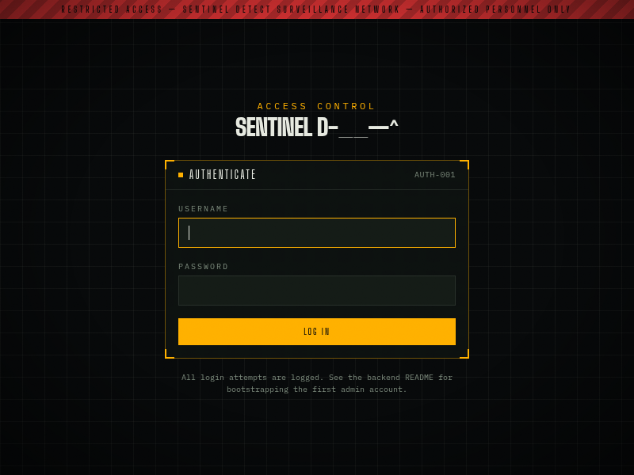
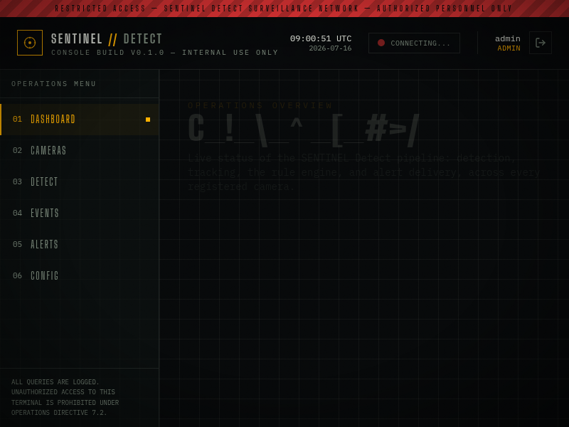
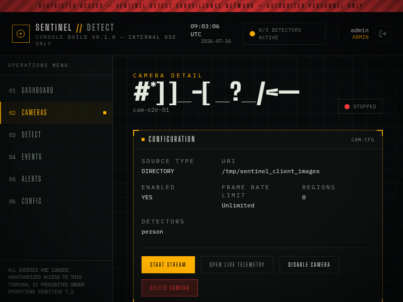
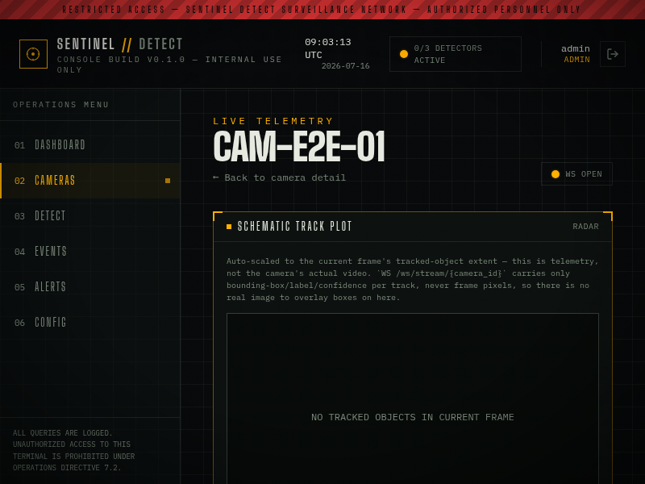

# SENTINEL Detect

**An AI-powered object detection and security analytics platform.** Point it
at a photo, a video file, or a live camera feed (webcam, USB, RTSP, IP
camera, or a watched directory of snapshots), and it runs a full
security-analytics pipeline: detect objects → track them across frames →
evaluate security rules against what's being tracked → dispatch alerts →
persist everything. It's the same pipeline whether the input is a one-shot
image upload or an indefinitely-running live stream from a camera on your
network.

The name and "restricted access" console styling are fictional-agency
branding for this project, not any real organization.

## What it actually does

- **Detects** person, vehicle (car/bus/truck/motorcycle/bicycle), weapon
  (gun/rifle/knife), fire/flame, smoke, PPE (hard hat/vest/gloves/glasses),
  and animal classes, via `Ultralytics YOLO` — person/vehicle/animal work
  out of the box on the stock COCO checkpoint; weapon/fire/smoke/PPE need a
  fine-tuned model an operator supplies (there's no honest free pretrained
  model for those, and this project doesn't pretend otherwise).
- **Tracks** every detected object across frames with a from-scratch
  ByteTrack implementation (Kalman filter + Hungarian-algorithm IoU
  matching + two-stage high/low-confidence recovery) — persistent per-camera
  track IDs, not just per-frame boxes.
- **Evaluates 12 built-in security rules** against what's being tracked:
  person/vehicle/weapon/fire/smoke detected, multiple people, a configurable
  crowd threshold, restricted-area intrusion, tripwire crossing
  (entering/leaving), loitering, an object abandoned, and an object removed
  — each with cooldown-based debouncing so one sustained condition doesn't
  spam a hundred duplicate alerts.
- **Dispatches alerts** through 4 real channels: an in-memory REST feed, a
  live WebSocket push, a webhook (real HTTP POST to a configured URL), and
  real SMTP email — all genuinely implemented, not stubs; webhook/email are
  disabled by default only because they need real external config (a URL,
  SMTP credentials) nobody can supply out of the box.
- **Streams live**, indefinitely, from a registered camera — the exact same
  detection → tracking → event → alert → storage chain a one-shot video
  upload runs, just running continuously with live per-frame telemetry
  pushed over a WebSocket.
- **Persists** every detection, event, and alert to a real database (SQLite
  by default, Postgres via one config change), with full camera CRUD,
  paginated query endpoints, and Alembic migrations.
- **Authenticates and authorizes**: JWT login or a static API key, with
  three roles (VIEWER < OPERATOR < ADMIN) gating who can register cameras,
  start streams, or change runtime config.

## Screenshots

The console (`client/`) is a dark "ops terminal" UI — every screenshot
below is a real screen from the running application, not a mockup.

| | |
|---|---|
|  |  |
|  |  |

The live-telemetry view (bottom right) is deliberately a schematic track
plot, not a video overlay — see "Design philosophy" below for why.

## Architecture

```
core/            entities + interfaces (ports). Depends on nothing.
detectors/       BaseDetector implementations, registered into a plugin registry.
models/          Inference backends (Ultralytics YOLO), swappable per detector.
tracking/        ByteTracker — Kalman filter + Hungarian IoU assignment.
events/          The rule engine: 12 built-in rules across 4 families.
alerts/          REST / WebSocket / webhook / email alert channels.
database/        Async SQLAlchemy engine/session + ORM models + repositories.
security/        Password hashing, JWT tokens, rate limiting, CORS.
streaming/       Video sources (webcam/RTSP/directory) + live per-camera pipelines.
services/        Use-case orchestration — the only place that wires adapters together.
api/             FastAPI routers, schemas, dependencies — the HTTP surface.
```

Every pluggable concern (detector, tracker, event rule, alert channel,
video source) follows the same pattern: a port (ABC) in `core/interfaces/`,
a `Registry[T]` that concrete implementations register into by string key,
and a config field naming which registered keys to activate. Adding a new
detector or alert channel never requires touching `core/`, `services/`, or
`api/` — see [`api/docs/architecture.md`](api/docs/architecture.md) for the
full reasoning behind every layer, every trade-off made, and what was
deliberately left out of scope and why.

## Tech stack

**Backend** (`api/`): Python 3.12, FastAPI, Pydantic v2 / pydantic-settings,
async SQLAlchemy 2.0 (SQLite by default, Postgres via one config change +
extra), Alembic, Ultralytics YOLO, PyJWT + bcrypt, Prometheus metrics,
`uv` for dependency management, Docker + docker-compose, pytest with 99%
coverage and GitHub Actions CI.

**Console** (`client/`): Next.js 14 (App Router), TypeScript, Tailwind CSS,
Framer Motion — the same design system as the sibling `face-recognition`
console (see `client/README.md`).

## Design philosophy: honesty over faking

This project was built with a hard rule: don't fake behavior the system
can't actually deliver. Concretely:

- Detectors needing weights nobody ships for free (weapon/fire/smoke/PPE)
  ship **disabled**, not backed by a placeholder model that would silently
  detect nothing while looking like it works.
- `object_abandoned`/`object_removed` are real, generic stationary/
  disappearance tracking — not a fake "bag detector" dressed up to look
  like one, since no such free detector exists.
- The live camera view is a schematic track plot, not a video overlay,
  because `WS /ws/stream/{camera_id}` genuinely only ever carries track
  metadata (bounding box, label, confidence) — never the frame's actual
  pixels, and not even its width/height. The console shows exactly that,
  honestly, rather than faking a video feed it has no data to render.
- Every phase of this build ends with a "Verified" section in
  [`api/docs/architecture.md`](api/docs/architecture.md) recording what was
  *actually* tested (real sockets, real databases, a real running server
  process) — not just what the code was intended to do.

## Repository layout

| Directory | What it is |
|---|---|
| [`api/`](api/README.md) | The backend — FastAPI, async SQLAlchemy, ByteTrack, YOLO inference, JWT/RBAC, live streaming, Docker, a 99%-covered test suite with CI |
| [`client/`](client/README.md) | The operations console — Next.js 14 + TypeScript + Tailwind |

## Quickstart

```bash
# Backend
cd api
uv sync --extra dev           # or: uv sync --extra dev --extra vision (real YOLO inference)
cp .env.example .env           # then set SENTINEL_SECURITY__BOOTSTRAP_ADMIN_PASSWORD to create the first user
uv run uvicorn sentinel_detect.main:app --reload

# Console (separate terminal)
cd client
npm install
cp .env.local.example .env.local
npm run dev
```

Open `http://localhost:3000`, log in with the bootstrap admin account, and
visit `http://localhost:8000/docs` for the interactive API reference.

Or with Docker (backend only — no local Python setup needed):

```bash
cd api && docker compose up --build
```

See each subdirectory's README for full setup details — Docker, model
weights, alert channel configuration, Postgres, running the test suite.

## Status

All 12 build phases are complete: architecture, detection engine, object
tracking, the rule engine, the alert engine, the database layer, the
FastAPI backend (auth/RBAC), live streaming, performance optimization,
Dockerization, testing (99% coverage, CI), and documentation — followed by
the console you see above. `api/docs/architecture.md` is the authoritative,
phase-by-phase record of all of it.
